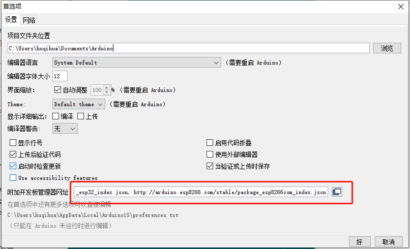
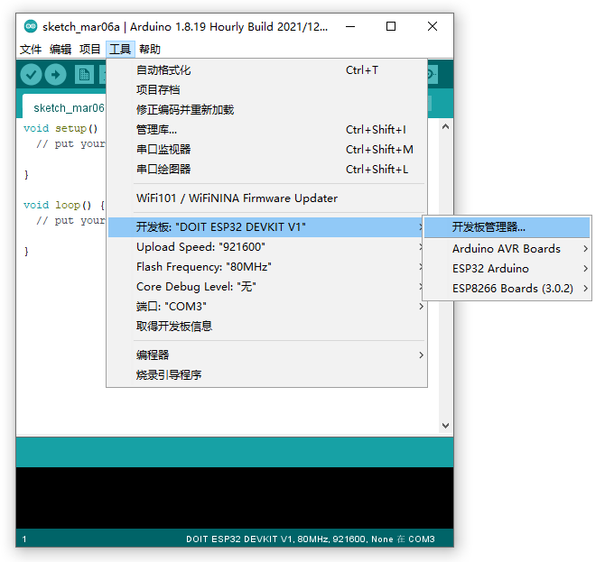
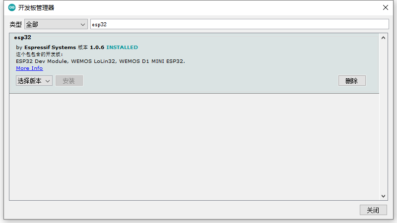
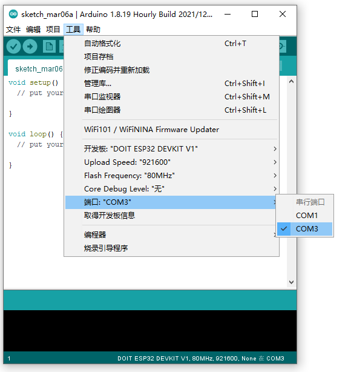
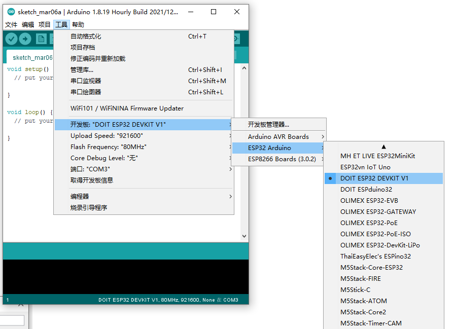
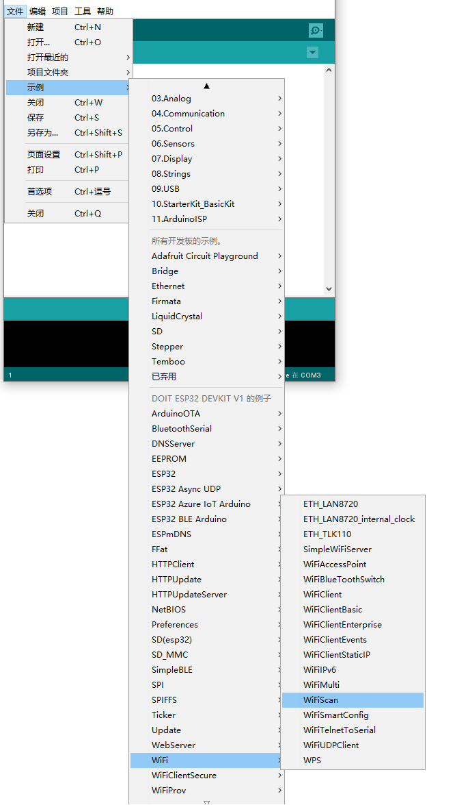
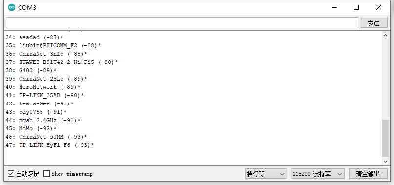

## 安装ESP32开发版的Arduino开发环境  

#### 1. 配置附件开发板管理器网址  

在**文件**菜单中打开**首选项**对话框，输入附加开发板管理器地址  

```
https://dl.espressif.com/dl/package_esp32_index.json, http://arduino.esp8266.com/stable/package_esp8266com_index.json
```

*提示：可顺便一起配置下ESP8266，多个地址使用英文格式的都好间隔*  




#### 2. 安装ESP32开发板管理器  

在**工具**菜单中打开**开发板板管理器**对话框，搜索esp32并安装  






#### 3. 配置开发板信息  

将开发板连接到电脑，并正确安装串口驱动（常见ESP32开发板的串口驱动芯片为CH340）  

在Arduino中选择**端口**为开发板所有串口号（例如Windows上，笔者的串口号为COM3）  

选择开发板型号为ESP32 Arduino下的**DOIT ESP32 DEKIT V1**   






#### 4. 跑个示例程序  

在**文件**菜单**示例**中选择WiFI Scan示例程序，编译并上传到开发板。然后打开串口监视器，波特率设置为115200，观察开发板是否正常扫描WiFi网络。  



